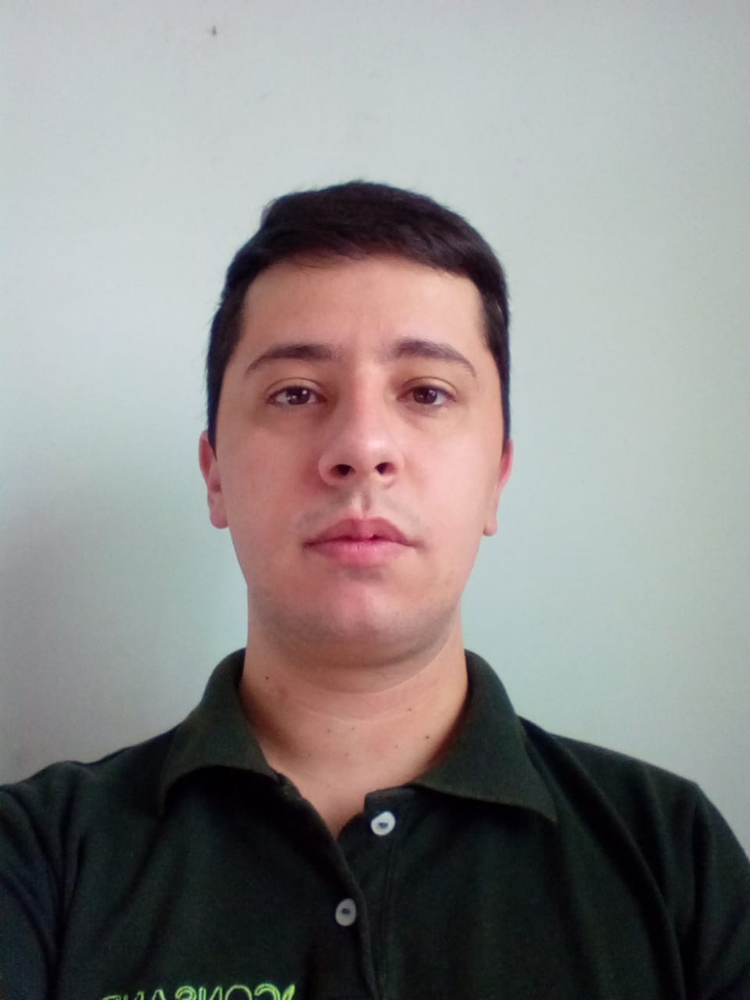

```{=html}
<style>
body {
  color: black;
  font-family: Times;
  font-size: 20px;
  text-align: justify;
  text-justify: inter-word;
}
pre {
  background-color: lightgreen;
}
#TOC {
  color: darkblue;
  font-family: Times;
  font-size: 14px;
  border-color: black;
}
#header {
  color: gold;
}
</style>
```
{width="20%"}
<br><br>

# Overview

Currently, **Arthur Boari** is developing his master's research in the area of air pollution --- investigating trends in time series of Particulate Matter and Tropospheric Ozone from capital cities in the southeastern region of Brazil. I am linked to the [Post-graduate Program in Environmental Engineering](https://sites.google.com/ufla.br/ppgeamb/p%C3%A1gina-inicial?authuser=0) at the Universidade Federal de Lavras (UFLA), where Prof. Dr. Marcelo Vieira-Filho supervises me. He was the only entrant in the research line Climate Change, Energy and Atmospheric Pollution in the second semester of 2020.

During my Undergraduate degree (2014-2020) in Environmental and Sanitary Engineering (UFLA) I developed several activities, to be discussed:

* My Final Paper addressed the use of four evapotranspiration estimation methods (FAO56-Penman-Monteith, Hargreaves & Samani, Makkink, and Thornthwaite) in the climatological water balance methodology (Thornthwaite & Matter) for historical series of meteorological data from eight stations in the northeastern part of the state of Minas Gerais. This area is characterized by the Aw and Cwa (Köppen) classifications. All the work was oriented by Prof. Dr. Sílvia de Nazaré Monteiro Yanagi (UFLA).

* In 2019 I joined the [Núcleo de Estudos em Poluição Urbana e Agroindustrial (NEP UAI)](https://sites.google.com/ufla.br/nepuai) where I had the opportunity to start developing projects in the area of atmospheric sciences, such as noise pollution and air pollution. During the three years I was there, I passed through several positions where I developed communication, people management, and project management skills. In March 2022 I finished my activities with them.

* Between 2016 and 2019 I worked in water and sewage analysis laboratories from treatment plants located on the UFLA campus. During this period I was linked to the Environmental Directorate (DMA/UFLA) as an experiential activity (2016), voluntary scientific initiation (2016-2017), and technical learning (2017-2019). Among the analyses performed are physical analyses (pH, conductivity, color, and turbidity), chemical analyses (Total Kjeldahl Nitrogen, Biochemical/Chemical Oxygen Demand, Manganese, Total Iron, Total Phosphorus, among others), and biological analyses (Total and Thermotolerant Coliforms).
<br>
<br>

# Master degree details

## Curricular components

### 2022/2

### 2022/1

### 2021/2

### 2021/1

### 2020/2